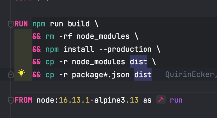

# Discord TS Template


This template can be used to create discord bots with the discord ts library. It is very simple to create events and 
commands (either with / or with a prefix).

## Getting Started Development

### Set the environment

Please take a look into the .env.template. In this file there is everything documented what you need to do to run 
this bot. If you want to you can also edit the package.json author description ...

### Install Dependencies

Install the dependecies with the following command.

```shell
npm install
```

### Run the bot

Run the bot with the following command.

```
npm start
```

## Getting Started Production

For production is a docker-compose file and a docker file included.

```shell
docker-compose up --build -d
```

- `--build`  builds the whole project before running
- `-d` runs the container in the background (Daemon)
- For more information refer to
  - https://docs.docker.com/
  - https://docs.docker.com/compose/

> Warning: If you have more directories which are required for the application you need to edit the Dockerfile. The 
> Dockerfile is only including everything in the application which is necessary.



